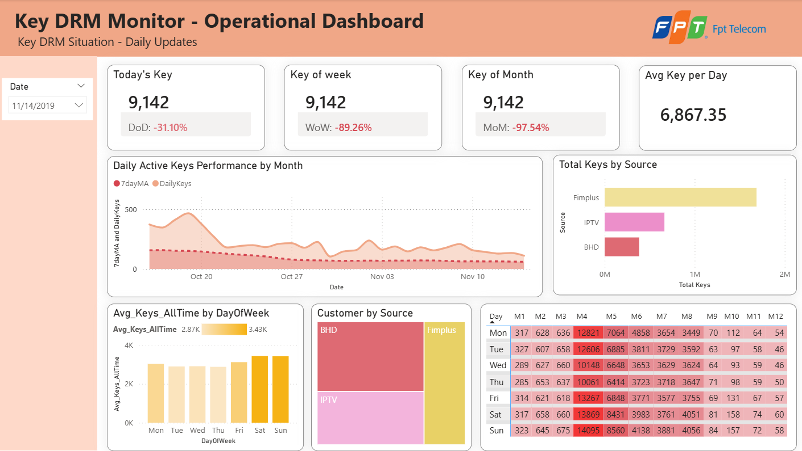

# DRM Key Demand Forecasting

> Analyzing and forecasting DRM key demand on an OTT platform to optimize digital content licensing costs.

## Business Context

When a user accesses DRM-protected content, the system issues a **DRM Key** to their device for that day. Keys are a purchased resource acquired in advance from content rights holders.

| Content Type | Source | Condition |
|---|---|---|
| Premium live channels | K+, Đặc Sắc | Any access to a Premium package channel |
| On-demand movies | Fim+, BHD | Only movies with `isDRM = 1` |

> 1 User × 1 day = 1 DRM Key (deduplicated by `CustomerID + MAC` across all sources)

## Problem Statement

| Scenario | Consequence |
|---|---|
| Purchase **too many** keys | Budget waste — unused keys expire |
| Purchase **too few** keys | Users can't access content → churn risk |

**Core question:** *How many DRM keys should we purchase next month?*

## Project Objectives

1. **Current state** — Daily key issuance volume and trend direction
2. **Consumption patterns** — Peak days of week and months
3. **Forecast demand** — Predict next 30 days of key consumption
4. **Recommend action** — Monthly purchase recommendation with buffer margin

## Dataset

| Table | Description |
|---|---|
| `Log_Get_DRM_List` | Key issuance log for Premium channels (K+, Đặc Sắc) |
| `Log_Fimplus_MovieID` | Viewing log for Fim+ on-demand movies |
| `Log_BHD_MovieID` | Viewing log for BHD on-demand movies |
| `MV_PropertiesShowVN` | Content metadata — filter DRM movies (`isDRM = 1`) |
| `Customers` | Device registry per customer |
| `CustomerService` | Service transaction history |

**Scale:** 500K – 5M records · **Source:** Azure SQL via DataGrip

## Key Business Logic

```
Total DRM Keys (per day) =
    COUNT DISTINCT (CustomerID, MAC) from:
        [Source A] Log_Get_DRM_List — Premium channel access
        UNION ALL
        [Source B] Log_Fimplus_MovieID + Log_BHD_MovieID
                   JOIN MV_PropertiesShowVN WHERE isDRM = 1
```

## Solution Architecture

```
Raw Data (Azure SQL)
        │
        ▼
[1] SQL — Extraction & Business Logic
        │   Unify 3 log sources, apply isDRM filter,
        │   compute daily COUNT DISTINCT (CustomerID, MAC)
        ▼
[2] Power BI — Operational Dashboard
        │   KPI cards, trend lines, weekday × month heatmap,
        │   channel vs movie split view
        ▼
[3] Python — Forecasting Pipeline
            EDA, seasonality decomposition,
            LightGBM forecasting, model evaluation (MAE, RMSE, MAPE)
```

## Repository Structure

```
drm-key-demand-forecasting/
│
├── sql/
│   ├── 01_view_drm_base.sql
│   ├── 02_daily_key_count.sql
│   ├── 03_weekly_trend.sql
│   ├── 04_weekday_pattern.sql
│   ├── 05_monthly_summary.sql
│   └── 06_source_breakdown.sql
│
├── powerbi/
│   ├── DRM_Key_Monitor.pbix
│   └── DRM_Key_Monitor.png
│
├── python/
│   ├── 01_data_preparation.ipynb
│   ├── 02_eda_visualization.ipynb
│   └── 03_forecasting_model.ipynb
│
├── Dataset/
├── requirements.txt
└── README.md
```

## How to Run

**Prerequisites:** Python 3.9+

```bash
# 1. Clone the repository
git clone https://github.com/TranDaiHai2107/drm-key-demand-forecasting.git
cd drm-key-demand-forecasting

# 2. Create virtual environment (recommended)
python -m venv venv
source venv/bin/activate        # Linux/Mac
venv\Scripts\activate           # Windows

# 3. Install dependencies
pip install -r requirements.txt

# 4. Run notebooks in order
jupyter notebook
```

Open notebooks sequentially:
1. `python/01_data_preparation.ipynb` — Load, clean, and engineer features
2. `python/02_eda_visualization.ipynb` — Exploratory analysis and pattern discovery
3. `python/03_forecasting_model.ipynb` — Train LightGBM model and generate 30-day forecast

> **Note:** Ensure CSV files are placed in the `Dataset/` folder before running.

## Key Results

**SQL** — Unified 3 log sources with device-level deduplication; identified clear weekly seasonality and channel vs movie demand split.

**Power BI** — Operational dashboard with utilization rate indicator and weekday × monthly heatmap for procurement planning.



**Python Forecasting** — LightGBM model for 30-day demand forecast with evaluation metrics (MAE, RMSE, MAPE) on holdout test set.

## Tech Stack

| Tool | Purpose |
|---|---|
| Azure SQL + DataGrip | Data querying and transformation |
| Power BI | Operational dashboard |
| Python (pandas, LightGBM, matplotlib, seaborn, statsmodels) | Forecasting pipeline and EDA |
| Jupyter Notebook | Analysis documentation |
